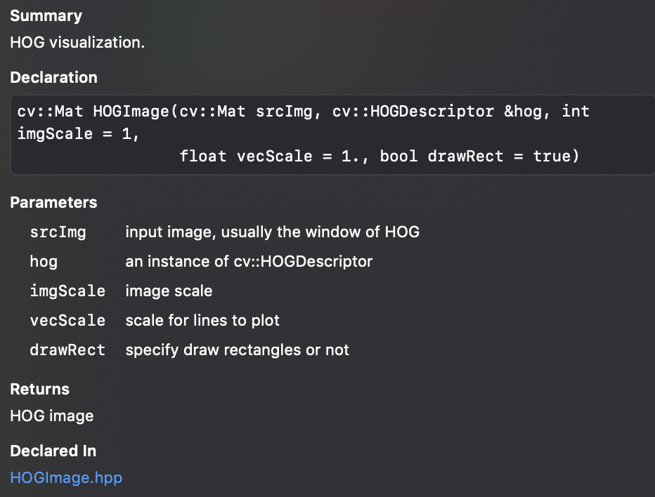
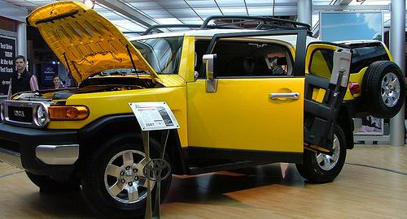
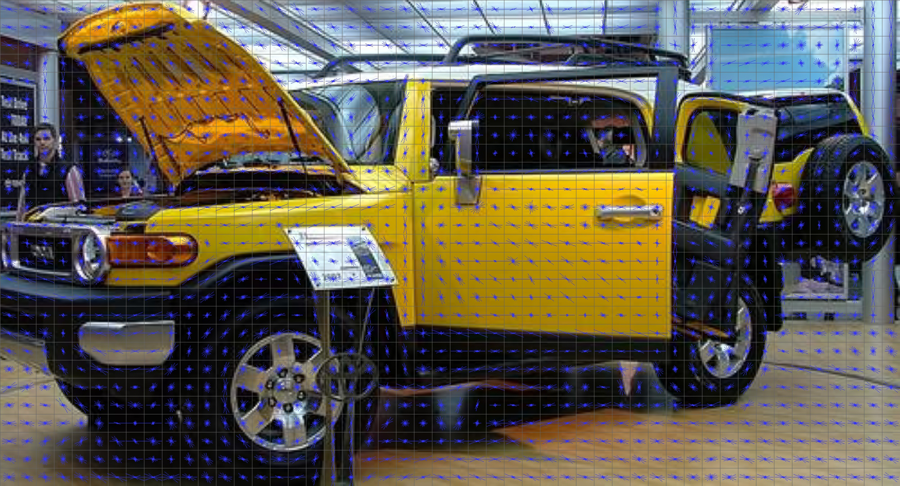

# HOG Visualization Using OpenCV(C++)


## Easy to use:

API:


```c++
#include "HOGImage.hpp"

int main(int argc, const char * argv[]) {
    Mat image = imread("images/teaser-original.jpg");
    HOGDescriptor hogDesc(image.size(),
                          Size(20, 20),
                          Size(10, 10),
                          Size(10, 10),
                          9);

    vector<float> desc;
    string name = "HOG window";
    namedWindow(name);
    imshow(name, HOGImage(image, hogDesc, 5, 3));
    waitKey();
}
```

## Example

Test image (The test image is from http://www.cs.columbia.edu/~vondrick/ihog/. If it is copyrighted, contact me and I will delete.):



Result:


